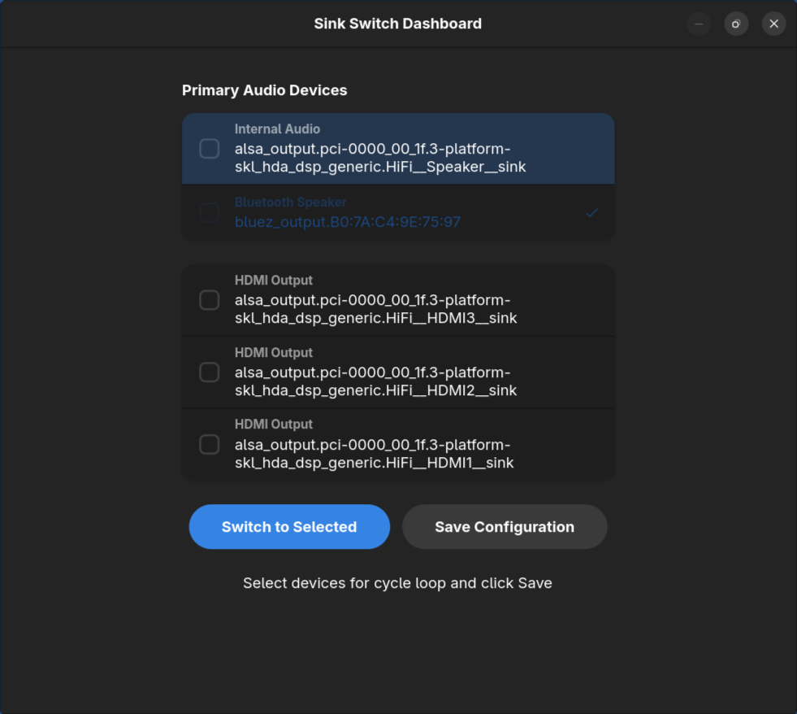
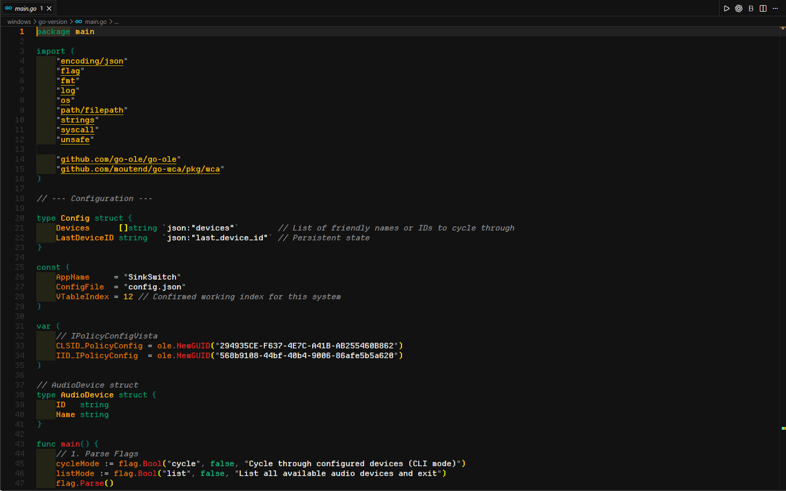
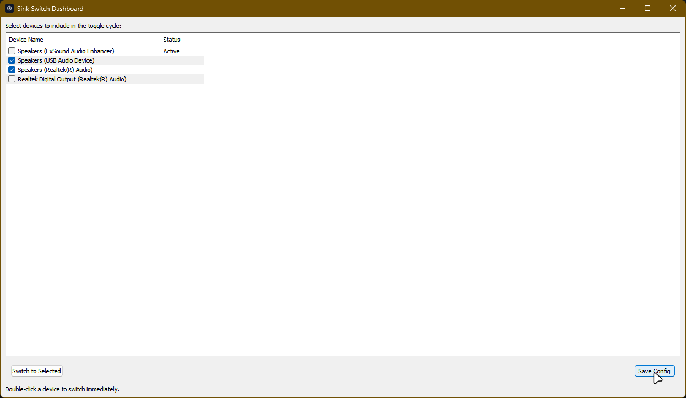

# Sink Switch

<p align="center">
  
</p>

<p align="center">
  <strong>Instant audio output switching for Linux and Windows.</strong>
  <br>
  Cycle between your preferred devices with a hotkey, a CLI command, or a native GUI.
</p>

<p align="center">
  <a href="https://github.com/KanishkMishra143/Sink-Switch/releases">Releases</a>
  ·
  <a href="site/docs/getting-started/index.html">Docs</a>
  ·
  <a href="#linux">Linux</a>
  ·
  <a href="#windows">Windows</a>
</p>

## Screenshots

<table>
  <tr>
    <td align="center" width="50%">
      
      <br>
      <strong>Linux GTK4 / Libadwaita dashboard</strong>
    </td>
    <td align="center" width="50%">
      
      <br>
      <strong>Windows native Go dashboard</strong>
    </td>
  </tr>
  <tr>
    <td align="center" colspan="2">
      
      <br>
      <strong>Device selection and cycle configuration</strong>
    </td>
  </tr>
</table>

## Overview

Sink Switch is a cross-platform utility for changing your default audio output without digging through system settings. It is built around a simple workflow:

- Pick the devices you care about.
- Bind a hotkey or run one command.
- Switch instantly and move active playback to the new output.

The repo currently contains:

- A Linux implementation built with Bash, `pactl`, desktop notifications, and a GTK4/Libadwaita dashboard.
- A Windows implementation built in Go with a native dashboard and CLI flags for cycling or listing devices.
- A legacy Windows AutoHotkey/PowerShell prototype kept in `windows/ahk-prototype/`.
- The project website and docs source in `site/`.

## Features

- Fast device switching from the keyboard or terminal.
- Native dashboards on both Linux and Windows.
- Configurable cycle list so only selected devices are included.
- Automatic movement of active playback streams on Linux.
- Friendly hotkey setup for GNOME, KDE, AutoHotkey, and other automation tools.
- Persistent config storage so the cycle order survives restarts.

## Linux

The Linux version lives in [`linux/`](linux/) and is centered around [`linux/sink-switch.sh`](linux/sink-switch.sh) plus the GTK dashboard in [`linux/sink-switch-gui.py`](linux/sink-switch-gui.py).

### Requirements

- `pactl` available through PulseAudio or PipeWire's PulseAudio compatibility layer
- `notify-send`
- `python3`
- GTK 4
- Libadwaita
- PyGObject

### Install

Install both files into the same directory so `--gui` can launch the dashboard correctly:

```bash
mkdir -p ~/.local/bin
install -m 755 linux/sink-switch.sh ~/.local/bin/sink-switch
install -m 755 linux/sink-switch-gui.py ~/.local/bin/sink-switch-gui.py
```

### Usage

```bash
sink-switch                 # cycle to the next configured sink
sink-switch --previous      # cycle backwards
sink-switch --list          # list available sinks
sink-switch --current       # show the current default sink
sink-switch --set <sink>    # switch directly to a specific sink
sink-switch --gui           # open the GTK dashboard
```

### Config

Linux stores its config at:

```text
~/.config/sink-switch/config.json
```

The dashboard lets you:

- Switch immediately to a selected sink.
- Choose which sinks are part of the cycle loop.
- Save the current cycle list for CLI and hotkey usage.

### Hotkeys

Bind `sink-switch` or `sink-switch --previous` in your desktop environment's global shortcut settings.

- GNOME: `Settings` -> `Keyboard` -> custom shortcut
- KDE Plasma: `System Settings` -> `Shortcuts` -> custom shortcut

## Windows

The recommended Windows version lives in [`windows/go-version/`](windows/go-version/). It uses the Windows Core Audio APIs directly and provides both a dashboard and CLI flags.

### Quick Start

You can either build it locally or download a packaged release from the [Releases](https://github.com/KanishkMishra143/Sink-Switch/releases) page.

```powershell
cd windows/go-version
go mod download
go build -ldflags "-H windowsgui" -o sink-switch.exe
```

### Usage

```powershell
sink-switch.exe         # open the dashboard
sink-switch.exe -list   # list active playback devices
sink-switch.exe -cycle  # cycle through configured devices
```

You can also pass device names after `-cycle` to create an ad-hoc cycle list:

```powershell
sink-switch.exe -cycle "Speakers" "Headphones"
```

### Config

Windows stores its config at:

```text
%APPDATA%\SinkSwitch\config.json
```

From the dashboard you can:

- See the currently active device.
- Choose which devices are included in the cycle list.
- Save the cycle list used by `sink-switch.exe -cycle`.
- Double-click or select a device to switch immediately.

### Hotkeys

The repo includes an AutoHotkey example in [`windows/go-version/keybindings.ahk`](windows/go-version/keybindings.ahk).

```autohotkey
!Volume_Mute::
    Run, "%A_ScriptDir%\sink-switch.exe" -cycle, %A_ScriptDir%, Hide
return
```

## Legacy Windows Prototype

The older script-based implementation is still available in [`windows/ahk-prototype/`](windows/ahk-prototype/). It is useful if you want a more hackable PowerShell + AutoHotkey workflow, but the Go version is the primary Windows implementation now.

## Project Structure

```text
linux/                  Linux CLI script and GTK dashboard
windows/go-version/     Native Windows implementation in Go
windows/ahk-prototype/  Legacy script-based Windows prototype
site/                   Website and documentation source
```

## Development

### Linux

```bash
./linux/sink-switch.sh --list
python3 ./linux/sink-switch-gui.py
```

### Windows

```powershell
cd windows/go-version
go mod download
go build -ldflags "-H windowsgui" -o sink-switch.exe
```

## License

MIT. See [`LICENSE`](LICENSE).
